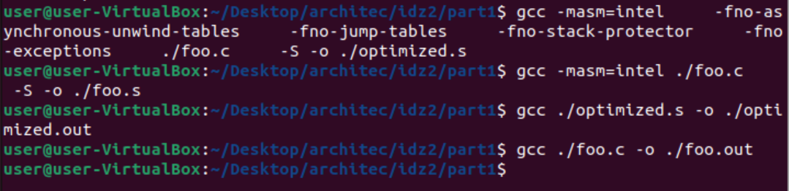

*ИДЗ № 2*
**Багрянский Константин Дмитриевчи БПИ 218**  
**Вариант №10**
Разработать программу, которая меняет на обратный порядок следования символов каждого
слова в ASCII-строке символов. Порядок слов остается неизменным. Слова состоят только из букв.
Разделителями слов являются все прочие символы.

*Оценка 4*  **папка part1**  
Файл foo.c - решение на языке C.  
Файл foo.s скомпилирован с флагом -masm=intel  (Добавлены комментарии)  
Файл optimized.s скопилирован с флагами -masm=intel -fno-asynchronous-unwind-tables -fno-jump-tables -fno-stack-protector -fno-exceptions  
Файл optimized.s отдельно откомпилирован и скомпонован.  

Полное тестовое покрытие программ (part1/tests): 
Тест 1:  
abc abcd ab ab abcd;; abcd;abc a  
Результаты:    
foo.out:        cba dcba ba ba dcba;; dcba;cba a   
optimized.out:  cba dcba ba ba dcba;; dcba;cba a  

Тест 2:  
Есть на скриншоте. Формат md портит тест, форматируя симолы.

Тест 3:  
abcd  
abcdf'];  
[]\abc  

Результаты:    
foo.out:  
dcba  
fdcba'];  
[]\cba  
optimized.out:  
dcba  
fdcba'];  
[]\cba  

Тест 4:  
'634683586;'  
Результаты:    
foo.out:          '634683586;'  
optimized.out:    '634683586;'  

Тест 5:  
abcdefg  
Результаты:    
foo.out:         gfedcba  
optimized.out:   gfedcba  

Вывод: программы работают одинаково на всех тестах.  

