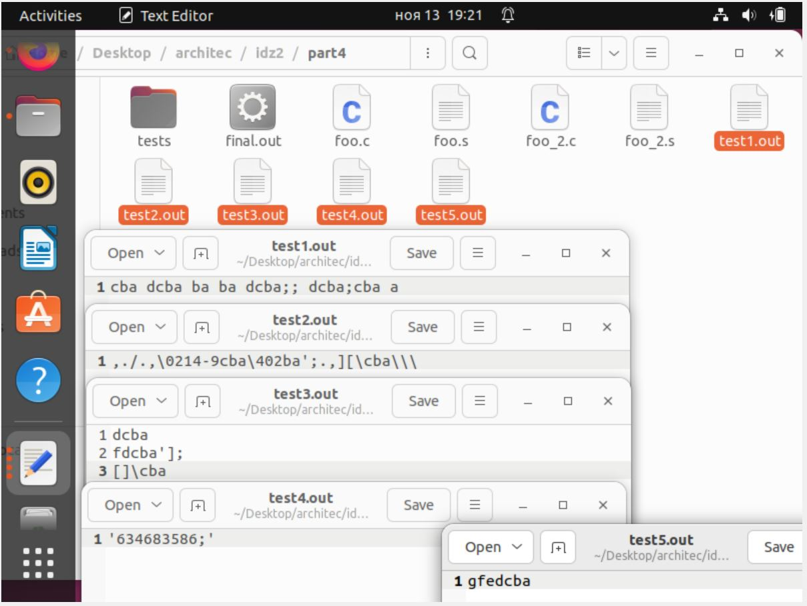

*ИДЗ № 2*
**Багрянский Константин Дмитриевчи БПИ 218**  
**Вариант №10**
Разработать программу, которая меняет на обратный порядок следования символов каждого
слова в ASCII-строке символов. Порядок слов остается неизменным. Слова состоят только из букв.
Разделителями слов являются все прочие символы.

*Оценка 4*  **папка part1**  
Файл foo.c - решение на языке C.  
Файл foo.s скомпилирован с флагом -masm=intel  (Добавлены комментарии)  
Файл optimized.s скопилирован с флагами -masm=intel -fno-asynchronous-unwind-tables -fno-jump-tables -fno-stack-protector -fno-exceptions  
Файл optimized.s отдельно откомпилирован и скомпонован.  

Полное тестовое покрытие программ (part1/tests): 
Тест 1:  
abc abcd ab ab abcd;; abcd;abc a  
Результаты:    
foo.out:        cba dcba ba ba dcba;; dcba;cba a   
optimized.out:  cba dcba ba ba dcba;; dcba;cba a  

Тест 2:  
Есть на скриншоте. Формат md портит тест, форматируя симолы.

Тест 3:  
abcd  
abcdf'];  
[]\abc  

Результаты:    
foo.out:  
dcba  
fdcba'];  
[]\cba  
optimized.out:  
dcba  
fdcba'];  
[]\cba  

Тест 4:  
'634683586;'  
Результаты:    
foo.out:          '634683586;'  
optimized.out:    '634683586;'  

Тест 5:  
abcdefg  
Результаты:    
foo.out:         gfedcba  
optimized.out:   gfedcba  

Вывод: программы работают одинаково на всех тестах.  

*Оценка 5*  **папка part2**   
Переделано решение на C. Добавлены функции с передачей данных через параметры. В функциях использованы локальные переменные.  
Файл foo.c:  
int reverse(int l, int r) - "переворачивает" подстроку с l по r  
l - индекс левый границы  
r -индекс правой границы
Файл foo.s:
Скомпилирован с флагами -masm=intel -fno-asynchronous-unwind-tables -fno-jump-tables -fno-stack-protector -fno-exceptions  
В ассемблерный код добавлены комментарии описывающие передачу параметров и перенос возращаемого результата, показывающие связь языка C и ассемблера.

*Оценка 6*  *папка part3*  
Была произведена переработка программы part2/foo.s за счёт использования максимального числа регистров  
Так же были добавлены комментарии поясняющие эквивалентные использования переменных в C
С результатом можно ознакомится в part3/foo_new.s
Так же полное тестовое покрытие (все тесты лежат в part1/tests):
Тест 1:  
abc abcd ab ab abcd;; abcd;abc a  
Результаты:    
foo.out:        cba dcba ba ba dcba;; dcba;cba a   
optimized.out:  cba dcba ba ba dcba;; dcba;cba a  

Тест 2:  
Есть на скриншоте. Формат md портит тест, форматируя симолы.

Тест 3:  
abcd  
abcdf'];  
[]\abc  

Результаты:    
foo.out:  
dcba  
fdcba'];  
[]\cba  
optimized.out:  
dcba  
fdcba'];  
[]\cba  

Тест 4:  
'634683586;'  
Результаты:    
foo.out:          '634683586;'  
optimized.out:    '634683586;'  

Тест 5:  
abcdefg  
Результаты:    
foo.out:         gfedcba  
optimized.out:   gfedcba  

Вывод: программы работают одинаково на всех тестах.  

*Оценка 7*  *папка part4*  
Была произведена переработка программы.  
Аргументами командной строки задаются входной и выходный файлы.  
Программа была разбита на 2 единицы компиляции foo.s и foo_2.s  
На скриншоте можно видеть компиляцию двух файлов в один final.out  
Так же на следущем скриншоте видно, что запись в файл работает корректно, так же как и работа программы.  

